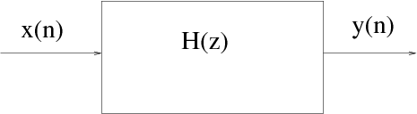
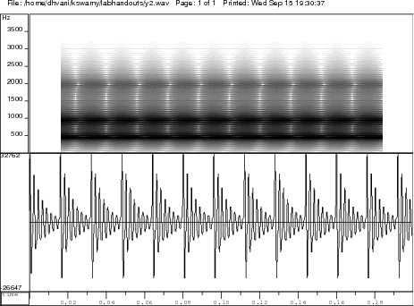

**Synthesizing vowels**

The objective of the experiment is to synthesize a vowel given its first three formant frequencies \(F_1\), \(F_2\), and \(F_3\), the fundamental period \(T_0\), and the sampling frequency \(F_s\) (or the equivalent sampling interval \(T=1/F_s\)). The system used in the synthesis of vowels is an all pole filter as shown in Figure 1.

  
 

**Figure 1:** All-pole filter.

The tranfer function H(z) of the all-pole system is given by $$ H(z) = \frac{1}{1+\sum^{N}_{k=1}{{a_k z^{-k}}}}, \qquad (1) $$ where \(\{a_k\}\)s denote the real coefficients of the denominator polynomial of order \(N\). Roots of the denominator polynomial in \(z^{-1}\) can be either real or complex. Real roots correspond to zero frequency or \(F_s/2\). Complex roots of a polynomial with real coefficients always occur in complex conjugate pairs corresponding to a frequency related to the angle of the complex root. Each pair of complex conjugate roots (or poles) corresponds to a second order polynomial which may be denoted as $$ H_i(z) = \frac{1}{(1-z_iz^{-1})(1-z_i^*z^{-1})} = \frac{1}{1+a_{i_1}z^{-1}+a_{i_2}z^{-2}}, \qquad (2)$$ where the complex root \(z_i\) is given by $$ z_i=r_i e^{j2\pi\frac{F_i}{F_s}}, \qquad (3) $$ where \(F_i\) denotes the resonance frequency of the second order system, and \(r_i\) corresponds to the resonance bandwidth \(B_i\) given by $$ r_i=e^{-\pi B_i T}, \qquad (4) $$ where \(T\) denotes the sampling interval. Now, each of the formant frequencies correspond to a resonance that can be generated by a second order all-pole system given by $$ H_i(z) = \frac{1}{1 - 2 e^{(-\pi B_i T)} cos(2 \pi F_i T) z^{-1} + e^{(-2 \pi B_i T)} z^{-2}}. \qquad (5) $$ Compute the coefficients of the second order filter for each of the formant frequencies. The combined system to synthesize the vowel can be constructed by cascading the individual second order filters given by $$ H_i(z) = \prod_{i=1}^{M} H_i(z), \qquad (6) $$ where \(M\) denotes the number of formant frequencies used to build the synthesizer. The coefficients of denominator polynomial of the combined system can be obtained by convolving the coefficient sequences of the individual second order filters.

The source used for excitation is a periodic unit sample sequence. Generate unit sample sequence of required length, depending on the length of the speech segment to be generated.

The vowel sound is synthesized by exciting the combined all-pole system with the generated excitation sequence. This can be implemented using a simple difference equation that can be derived from Eq. (1).

**Illustration of synthesizing vowel /a/:**

 - Given,
   - Formant frequencies F1 = 560 Hz, F2= 1180 Hz, and F3= 2480 Hz
   - Pitch period, T0 = 7.5msec
   - Sampling frequency, Fs=10000Hz

 - For a given formant frequency Fi, let its bandwidth be Bi = 0.1* Fi

 - For each (Fi , Bi) system parameters are computed using Eq. (2), where the sampling interval (1/Fs) used is 100*10-6 sec, for a sampling rate of 10 kHz.

 - Substituting F1 = 560 Hz Hz, B1 = 56 Hz Hz in Eq. (1) we get

    $$ H_1(z) = \frac{1}{ 1 - 1.8447*z^{-1} + 0.9654* z^{-2}} \qquad (3) $$

 - Substituting F2= 1180 Hz Hz, B2= 118 Hz Hz in Eq. (1) we get
    
    $$ H_2(z) = \frac{1}{ 1 - 1.4213*z^{-1} + 0.9285* z^{-2}} \qquad (4) $$

 - substituting F3= 2480 Hz Hz, B3= 248 Hz Hz in Eq. (1) we get
    
    $$ H_3(z) = \frac{1}{ 1 - 0.0232*z^{-1} + 0.8557* z^{-2}} \qquad (5) $$

 - The system transfer function H(z) is given by, H(z)=H1(z) * H2(z) *H3(z)

 - Substituting for H1(z), H2(z), H3(z) we get
    
    $$ H(z)=\frac{1}{1+a_1z^{-1}+a_2z^{-2}+a_3z^{-3}+a_4z^{-4}+a_5z^{-5}+a_6z^{-6}}. \qquad (6) $$

 - From Eq. (6) we have \( \{b_k\}\)=[1] and \( \{a_k\}=\)[1, -3.2892, 5.472, -5.9844, 4.8321, -2.6606, 0.7670]

 - We can also compute the \(\{a_k\}\)s of the combined system by convolving the \(\{a_k\}\)s of the individual resonators \(H_1(z)\), \(H_2(z)\), and \(H_3(z)\). i.e., by convolving [1,-1.8447,0.9654], [1, -1.4213, 0.9285]), and [1, -0.0232, 0.8557])

 - Generate the unit sample sequence to be used as the excitation at the given pitch period (7.5 msec i.e., 75 samples at 10 kHz). The resulting sequence has ones at every 75 sample interval and all other values are zero.

 - Figure 2 shows the excitation sequence and the signal synthesized for a particular pitch period. It also shows the excitation sequence and signal for half the pitch period and twice the pitch period case.

 - Figures 3, 4, and 5 show the synthesized signals for the sound unit /a/ and the corresponding spectrograms for excitations with a period of half the pitch period, the given pitch period, and twice the pitch period, respectively.

The excitation and the response of the all-pole filter for impulse sequence excitation with a period of 3.75ms, 7.5ms and 15ms respectively.

  
 

**Figure 2:** The excitation and the response of the all-pole filter for impulse sequence excitation with a period of 3.75ms, 7.5ms and 15ms respectively.

  
 

**Figure 3:** Waveform of the the synthesized vowel /a/ and its spectrogram obtained with an impulse sequence excitation of pitch period 3.75 ms.

  
 

**Figure 4:** Waveform of the the synthesized vowel /a/ and its spectrogram obtained with an impulse sequence excitation of pitch period 7.5 ms.

  
 

**Figure 5:** Waveform of the the synthesized vowel /a/ and its spectrogram obtained with an impulse sequence excitation of pitch period 15 ms.

